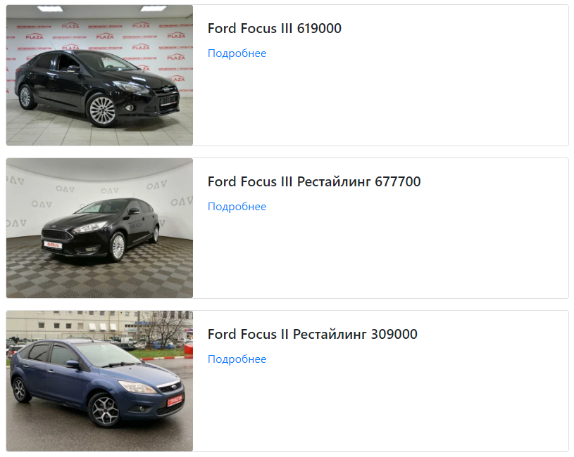

# AutoParse
Парсер объявлений о продаже автомобилей с различных площадок



# Установка
Установите Python пакеты из `requirements.txt:`
```
pip install -r requirements.txt
```
Для получения подборки автомобилей с сайтов, достаточно запустить файл `start.bat`.

# Что произойдет?
В первую очередь запустятся скрипты сбора объявлений для каждого из сайтов.

Результаты парсинга сохраняться в отдельные `*.json` файлы внутри каталога `data`.(При повторном запуске парсер добавит новые данные в конец файла и этим сломает JSON, поэтому старые файлы с данными лучше удалять перед повторным запуском).

После этого, запускается скрипт `render.py`. Скрипт создаст файл index.html или обновит его, если такой уже существует. Откройте файл index.html в браузере.
